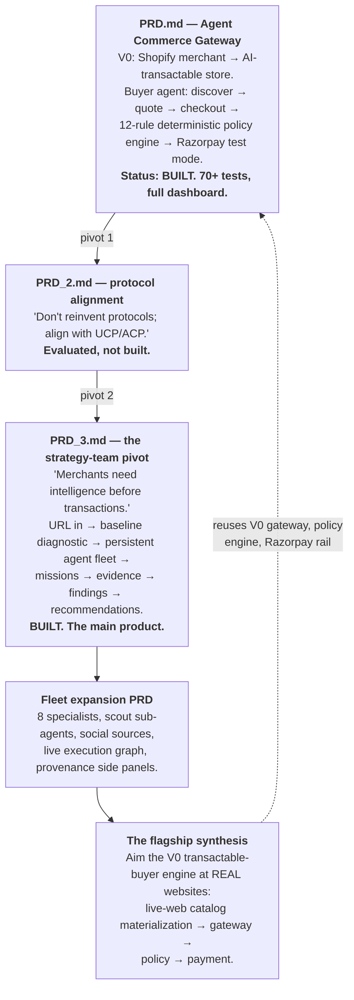
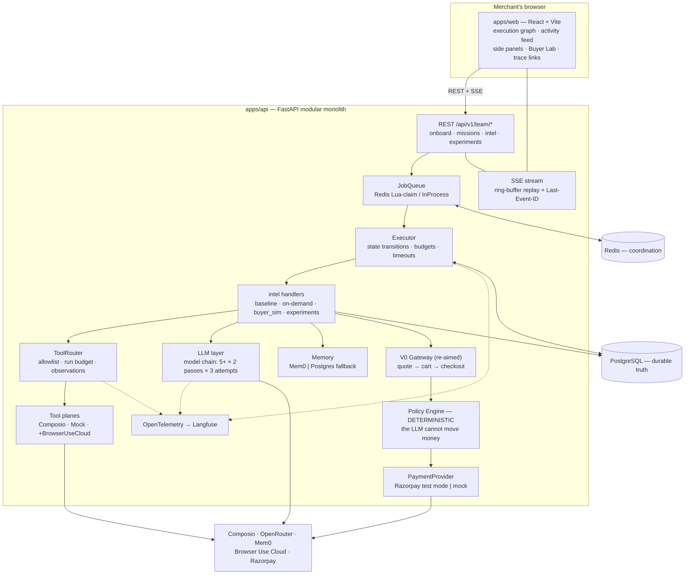
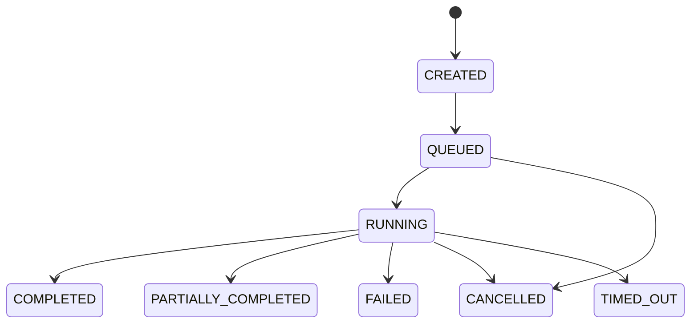
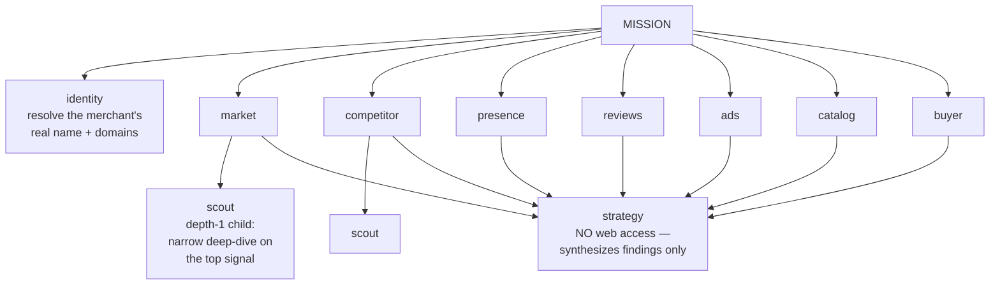
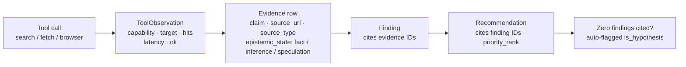
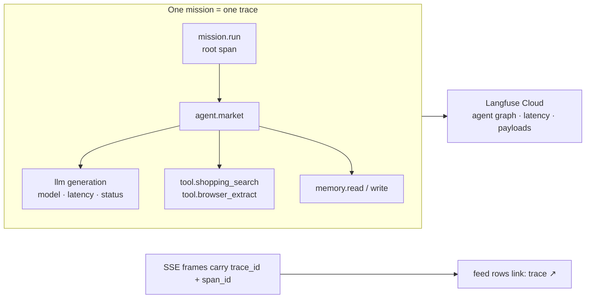
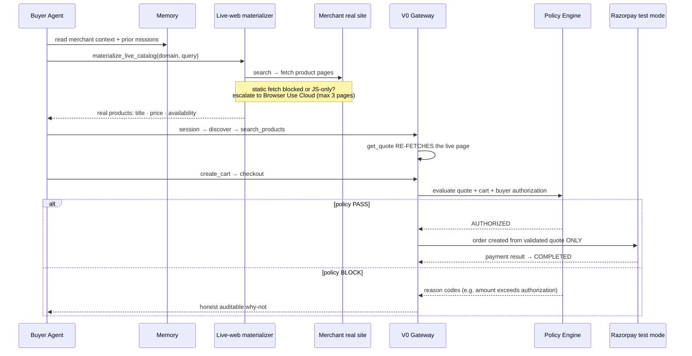
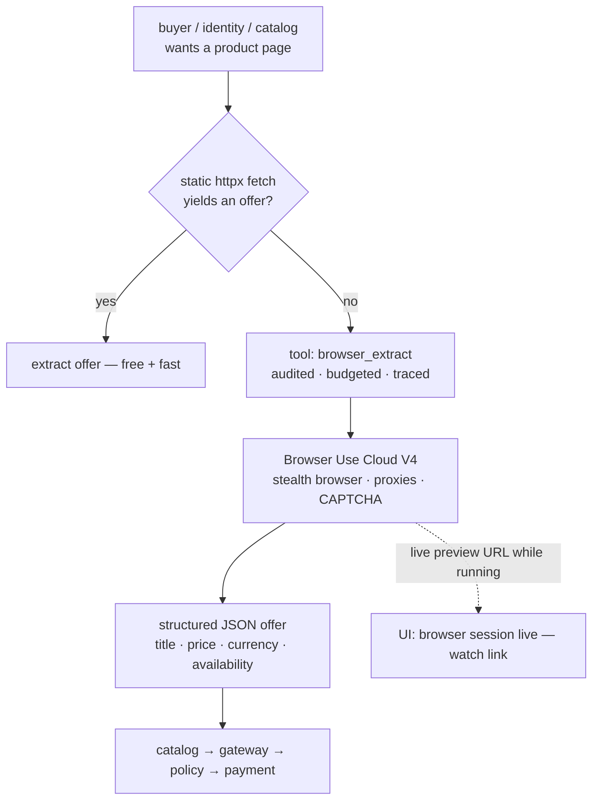

# Agent Commerce — Product Journey & Demo Guide

> From "make a Shopify store AI-transactable" to "an always-on AI strategy team
> that researches any merchant on the live web — and proves whether an AI buyer
> can actually transact with it."
> Narrative companion to `docs/DEEP_DIVE.md` (the deep technical build log).
> This one is built for demoing: the story, the architecture, the hard
> engineering, and the exact demo script.

---

## Table of Contents

1. [The Thesis](#1-the-thesis)
2. [Ideation & the Two Pivots](#2-ideation--the-two-pivots)
3. [What the Product Is Today](#3-what-the-product-is-today)
4. [System Architecture](#4-system-architecture)
5. [The Mission Engine](#5-the-mission-engine)
6. [The AI Team — Eight Specialists and a Scout](#6-the-ai-team--eight-specialists-and-a-scout)
7. [Evidence & Epistemic Honesty](#7-evidence--epistemic-honesty)
8. [Observability — OpenTelemetry + Langfuse](#8-observability--opentelemetry--langfuse)
9. [The Flagship: The AI-Transactable Buyer](#9-the-flagship-the-ai-transactable-buyer)
10. [The Stealth Browser — Browser Use Cloud](#10-the-stealth-browser--browser-use-cloud)
11. [The Buyer Lab](#11-the-buyer-lab)
12. [Resilience Engineering](#12-resilience-engineering)
13. [War Stories — Real Bugs, Real Lessons](#13-war-stories--real-bugs-real-lessons)
14. [The Demo Script](#14-the-demo-script)
15. [Honest Caveats](#15-honest-caveats)

---

## 1. The Thesis

```text
A merchant should not need to rebuild their website for the agentic era.

Connect a URL. Our AI team studies the merchant from the outside in —
market, competitors, reputation, catalog — produces evidence-backed findings
and a ranked strategy, and then answers the question that decides the next
decade of commerce:

    "Can an AI buyer actually buy from me — and if not, why not?"
```

Every claim the system makes is traceable to a source. Every payment decision
is made by a deterministic policy engine, never by an LLM. Every step of every
agent run is observable in a live trace.

## 2. Ideation & the Two Pivots

The product changed direction twice. Each pivot kept the previous build intact
and reusable — which is why the repo contains three PRDs and two working
products.



**The key strategic move:** the V0 gateway (canonical commerce model, quote →
cart → checkout state machine, deterministic policy engine, Razorpay test-mode
rail) was already built and tested for Shopify. Instead of discarding it, we
*re-aimed* it at **any real website**: a live-web materialization layer now
derives the merchant's catalog from their actual site at session time. The old
thesis — "make one Shopify merchant AI-native" — became "measure how AI-native
ANY merchant already is, and try to buy from them for real."

---

## 3. What the Product Is Today

One URL in. Three things out:

1. **A baseline intelligence report** — an eight-agent fleet researches the
   merchant on the live web (market, competitors, reputation, reviews, ads,
   catalog), persists every claim with provenance, and synthesizes ranked,
   evidence-cited recommendations.
2. **A live, watchable execution** — every agent run streams to the UI over
   replay-safe SSE; the execution graph shows parent→child agent trees with
   live status; activity rows link to their Langfuse traces.
3. **An AI-transactability verdict** — the buyer reads its memory,
   materializes the merchant's *real* catalog from their *real* website
   (penetrating anti-bot walls via a managed stealth browser), picks a product
   for its persona, gets a live quote, creates a cart, requests checkout — and
   a **deterministic policy engine** decides whether money may move. Every
   outcome is explained: completed, blocked (reason codes), or untransactable
   (exact friction reasons).

---

## 4. System Architecture



Non-negotiable design rules (enforced in code, not docs):

- **Postgres is truth; Redis is coordination.** A Redis crash loses nothing —
  QUEUED missions replay from the DB.
- **Every external call** has a timeout, bounded exponential-backoff retries,
  and structured errors. Tool failure degrades a mission; it never kills one.
- **Bounded everything:** mission caps, worker fan-out, LLM semaphore,
  sub-agent depth ≤ 1, browser pages per run ≤ 3.
- **The LLM proposes; the gateway executes; the policy engine authorizes.**

## 5. The Mission Engine



What makes this engine production-shaped rather than a demo script:

| Mechanism | How it works |
|---|---|
| **Atomic budget claims** | `UPDATE missions SET runs_used = runs_used+1 WHERE runs_used < budget_runs`; rowcount 0 ⇒ denied. Parallel fan-out can never overshoot (found live: 5 runs on a 3-run budget). |
| **Race-free transitions** | Every transition is a conditional `UPDATE … WHERE status IN (expected)`. Duplicate workers are harmless — the loser stands down. |
| **Cooperative cancel** | Agents check `ctx.ensure_not_cancelled()` between steps; a dedicated `MissionCancelled` exception unwinds the handler, never the worker task. |
| **Three nested timeouts** | LLM call 90s < agent run 300s (720s for buyer runs — real storefronts are slow) < mission 900s. Nothing is ever left in RUNNING. |
| **Two queue drivers, one interface** | Redis (Lua atomic claim, leases, heartbeats, crash recovery) for multi-process; asyncio in-process for the single-command demo. Swap by env var. |
| **Admission control** | Global (4) and per-merchant (2) concurrency limiters; over-limit jobs are released back, not rejected. |

---

## 6. The AI Team — Eight Specialists and a Scout



| Agent | Sources | Produces |
|---|---|---|
| `identity` | first-party fetch + verification searches | canonical name, category, geography, official domains |
| `market` | trends · news · web · youtube | demand signals, category trends |
| `competitor` | shopping · news · web | competitor pricing/positioning |
| `presence` | reddit · social · news · web | reputation, sentiment, community voice |
| `reviews` | reddit · youtube · social | voice-of-customer, product feedback |
| `ads` | social · web · news | promotions, offers, creative freshness |
| `catalog` | shopping · web + browser | product/price/rating depth |
| `buyer` | shopping · web · fetch · **browser** | a persona's real purchase attempt + friction report |
| `strategy` | **none** — stored findings + memory only | ranked, evidence-cited recommendations |

Orchestration details that matter:

- **Phase A runs six research agents in parallel** (semaphore-bounded); the
  buyer follows; strategy closes. Scout children spawn at depth 1 — guarded by
  depth limits, child budgets, and mission budget, with every
  spawn request/accept/reject emitted as an event.
- **Tool permissions are a matrix, not a vibe.** The `ToolRouter` denies
  disallowed capabilities before burning budget. Strategy is deliberately
  web-blind: its recommendations can only cite evidence already in Postgres —
  which is what makes them auditable.
- **Memory is per-merchant and persistent.** Buyer runs read prior mission
  context ("Known context from previous missions: …") so repeat visits behave
  like a returning customer, not a goldfish.

---

## 7. Evidence & Epistemic Honesty

The single most product-defining rule: **findings cannot exist without
provenance.**



- `persist.py` is the **only writer** of evidence/findings/recommendations —
  provenance rules live in exactly one place.
- Even **failed tool calls** become evidence rows marked `[FAILED: reason]` —
  the system reports "shopping search returned zero results" honestly instead
  of inventing data.
- A relevance gate rejects off-entity claims (the "Snitch the fashion brand vs
  Snitch the CI/CD tool" problem) before they can become findings; rejected
  claims never reach strategy.
- Recommendations citing zero findings are automatically labeled **hypotheses**
  in the UI — the system never presents speculation as strategy.

## 8. Observability — OpenTelemetry + Langfuse



- Instrumentation sits on **canonical boundaries only** (mission executor,
  agent run, LLM provider chain, ToolRouter, memory adapters) — one wrapper
  per boundary covers every plane and provider.
- Tracing is **best-effort by contract**: a Langfuse outage can never fail a
  mission, block a tool call, or stall SSE (a dedicated test asserts this).
- SSE frames carry `trace_id`/`span_id`, so the merchant UI and the developer
  trace are two views of one execution — click a feed row's `trace ↗` to open
  the exact moment in Langfuse.

---

## 9. The Flagship: The AI-Transactable Buyer

This is where the two products merge. The buyer agent doesn't *describe* a
purchase — it **performs** one against the merchant's real website, and the
system's deterministic guardrails decide whether money moves.



The rules that make this demo-grade engineering, not theater:

- **The LLM can decide what it wants to attempt. It cannot unilaterally decide
  that money is allowed to move.** Checkout passes through a deterministic
  policy engine (quote validity, inventory, currency match, buyer limit,
  merchant limit, amount equality…). The payment amount comes from the
  validated quote — never from model text.
- **Stale-price protection is real, not mocked:** quote-time validation
  re-fetches the merchant's *actual live page*. If their real price changed,
  the policy engine blocks with `PRICE_CHANGED_SINCE_QUOTE`.
- **"AI-untransactable" is a finding, not a failure:** if a page yields no
  machine-readable price, no availability signal, or a policy block, the
  system records exactly why — that is the merchant's AI-nativeness report.
- **Personas decide differently by design:** price-conscious, premium-seeking,
  and first-time personas read memory, weigh constraints, and produce different
  journeys — which is what the experiment engine (control-vs-treatment
  cohorts, simulated lift) builds on.

## 10. The Stealth Browser — Browser Use Cloud

Real storefronts (adidas-class) serve bot-walls, CAPTCHAs, and JS-only shells
to plain HTTP fetchers. The tool plane answers with a managed stealth browser:



- Escalation is **credit-disciplined**: hard cap of 3 browser pages per run;
  the free static path always runs first.
- Every browser call is an **ordinary audited tool call** (budget + evidence
  row + Langfuse span) — no side-channel automation.
- While the browser task executes, a `browser.session` SSE frame carrying the
  **live preview URL** hits the activity feed mid-run: you can literally watch
  the agent browse the storefront in real time.
- Swappable by design: the browser is one `ToolPlane` wrapper — self-hosted
  Browser Use later is a config change, not a rewrite.

**Live result:** against `adidas.co.in` the buyer materialized three real
products with real names and prices (Samba OG, Questar 3, Ultraboost 5),
matched a persona's size/budget spec, and drove the gateway flow — adidas'
bot-defense ultimately blocked checkout automation, which is itself the exact
"AI-transactability friction" finding this product exists to surface.

---

## 11. The Buyer Lab

Re-running the whole research pipeline just to test the buyer took 10–15
minutes (including a ~90s strategy pass). The **Buyer Lab** is a dedicated
quick action on the team page:

- a prompt box for the shopping intent ("Ultraboost 5, size 9, white, under
  ₹20,000") — parsed into persona, product spec, budget, constraints;
- creates a `buyer_sim` mission that runs **only** the buyer (identity loads
  from cache) — no fleet, no strategy pass;
- auto-navigates to the live mission page: execution graph, SSE activity,
  browser-session watch link, and the buyer's friction findings on landing;
- ~2–4 minutes end-to-end vs ~10–15 for the full pipeline — a real iteration
  loop for merchants asking "can an AI buy from me today?"

---

## 12. Resilience Engineering

The recurring theme of this build: **free/shared LLM pools and the live web
are hostile environments.** The system survives both.

| Layer | Failure mode observed live | Response in code |
|---|---|---|
| LLM provider | OpenRouter returns **HTTP 200 with an error body** (`{"error": …}`, no `choices`) when an upstream provider dies | 200-without-`choices` treated as a dead model → skip → next model in the chain (fleet client *and* buyer brain). Was a `KeyError: 'choices'` crash killing whole runs. |
| LLM throttling | 429 storms across both free models simultaneously | 5+ models × 2 passes × 3 attempts, exponential backoff to ~45s with jitter, Retry-After honored |
| Model selection | Single hard-coded buyer model | Credential + model-chain fallback: `AGENT_LLM_*` → `STRATEGY_LLM_*` |
| Web scraping | Bot-walls, JS-only shells, CAPTCHAs | static fetch → stealth-browser escalation, bounded per run |
| Site structure | Pages with no machine-readable price/availability | honest `untransactable_reasons`, never hallucinated offers |
| Latency | Real storefront materialization + gateway session > 300s run ceiling | dedicated 720s buyer-run deadline |
| Data integrity | Flush-before-assignment shipped NULL titles to a NOT NULL column; `InStock` casing mismatch marked in-stock items unavailable | ordering fixes + case-insensitive comparisons + regression tests |
| Wiring | Bridge passed a context object with no DB session (`'RunContext' object has no attribute 'db'`) | bridge owns its session; regression test asserts a real session reaches the materializer |

Every fix above has a test named after the failure it prevents.

## 13. War Stories — Real Bugs, Real Lessons

The full 25-entry log lives in `docs/DEEP_DIVE.md §14`. The ones that shaped
the architecture:

1. **"Missions queued forever."** Two compounding bugs: the API created
   missions but never called enqueue, and `build_queue()` returned *fresh*
   in-process queues so producer and consumer held different objects. Lesson:
   integration smoke tests against a running server catch seams unit tests
   structurally cannot. → process-wide queue singleton.
2. **"5 runs on a 3-run budget."** Count-then-create raced under parallel
   fan-out. → atomic conditional `UPDATE` claims; rowcount is the only truth.
3. **`KeyError: 'choices'` killed agent runs.** OpenRouter's 200-with-error-
   body. The entire fallback chain was bypassed by one unvalidated dict access.
   → 200-without-choices = dead model, skip. (Later re-fixed identically in
   the buyer brain — same bug family, second host.)
4. **"The buyer completed but bought nothing."** Its shopping search returned
   zero hits and the empty case was swallowed at INFO level — the audit trail
   had no row at all. → broadened-query retry, web fallback, WARNING logging,
   failed searches persist as evidence rows.
5. **"Materialization failed: null value in column title."** The upsert
   flushed the INSERT before assigning the title; the fallback chain that
   would have prevented NULL was one line too late. → assignment-before-flush.
6. **"Every product was out of stock."** `"Instock" in availability` never
   matched schema.org's canonical `https://schema.org/InStock`. A
   case-sensitivity bug made the whole catalog unsellable. → case-insensitive
   comparison + tests asserting in-stock extraction.
7. **"Timeout at exactly 300,981 ms."** Real-site materialization (~245s) plus
   a 12-step LLM gateway session cannot fit a 300s ceiling — the 900s mission
   ceiling never came into play. → per-agent deadlines (buyer gets 720s).
8. **The adidas arc** — five consecutive bugs, each found only by running
   against the real site: missing DB session → un-awaited coroutines →
   flush ordering → stock casing → missing titles + unsearchable catalog.
   The lesson that defined the demo: **synthetic fixtures pass; the live web
   is the only honest test environment.**

## 14. The Demo Script

**Setup (before the audience arrives):** `docker compose up --build`,
migrations applied, `.env` loaded (OpenRouter + Composio + Mem0 + Browser Use +
Razorpay test keys). Open the web app on the merchant you want to demo.

**Act 1 — The team (≈4 min).**
1. Team page: introduce the eight specialists as a hires-for-your-store team.
2. Launch a full baseline mission on a real merchant URL. Watch the execution
   graph fill in: specialists go green one by one, scouts spawn under their
   parents, the activity feed streams tool calls with live sources.
3. Open Langfuse in a second tab — the same mission as a trace tree. Click a
   feed row's `trace ↗` to jump between the UI and the trace live.

**Act 2 — The receipts (≈3 min).**
4. Open the finished mission: click any finding → the side panel shows every
   evidence row (claim, epistemic state, source URL) — click through to the
   real source. Show a hypothesis-flagged recommendation to prove the system
   separates evidence from speculation.
5. Show the ranked recommendations — strategy's synthesis, every item
   traceable to findings.

**Act 3 — Can an AI buy from me? (≈5 min, the closer).**
6. Open the **Buyer Lab**. Type the spec: "Ultraboost 5, size 9, white, under
   ₹20,000." Run it.
7. Watch the buyer: memory read → live-web materialization (point out the
   `browser session live — watch ↗` row and open the viewer — the audience
   sees a stealth browser rendering the merchant's real page).
8. The gateway flow: discover → search (real products, real prices) → quote →
   cart → checkout → **policy decision**.
9. Tell the outcome story whichever way it lands:
   - **Completed** — "an AI buyer just bought from this store; every step is
     audited."
   - **Blocked** — show the reason codes; the deterministic policy engine
     refused, by design. "The LLM never moves money."
   - **Untransactable / bot-blocked** — "this is the merchant's AI-readiness
     report: exactly why an AI buyer couldn't transact. That IS the product."

**Act 4 — Safety (30 seconds).** A deliberate block demo exists in the V0
rail: change the live price, run again, watch the policy engine refuse while
the payment call never fires.

Closing line: *"We didn't build a shopping chatbot. We built an AI team that
makes any merchant legible to the agentic era — and proves, with receipts,
whether an AI buyer can actually transact with them."*

---

## 15. Honest Caveats

- **Real sites fight back.** adidas-class bot-defense can block even the
  stealth browser's checkout automation. We present that as a first-class
  finding (it is literally the product's question being answered), but demo
  flows are smoothest on a merchant with moderate protection — or the V0 mock
  store for a guaranteed happy path.
- **Free-tier LLM pools** occasionally throttle; the chain rides out
  multi-minute windows, but a live demo can feel slow at peak. Pre-warming a
  mission before the audience arrives is cheap insurance.
- **Experiments are simulated** (`is_simulated=true` everywhere, explicit
  non-production notes): control-vs-treatment buyer cohorts measure modeled
  lift, not real revenue.
- **First-run cold start:** identity resolution runs live (~1–2 min) on a
  fresh merchant; repeat runs use the cache.
- **Payments are test-mode** (Razorpay test keys / mock provider). No real
  money, no stored credentials — by design and by policy.
- **Auth is single-operator scaffolding**, consistent with demo scope.

---

*Every claim above traces to code in the repo and tests that pass today. The
deep technical companion — schemas, full API reference, the complete 25-bug
log, and measured load-test numbers — lives in `docs/DEEP_DIVE.md`.*


